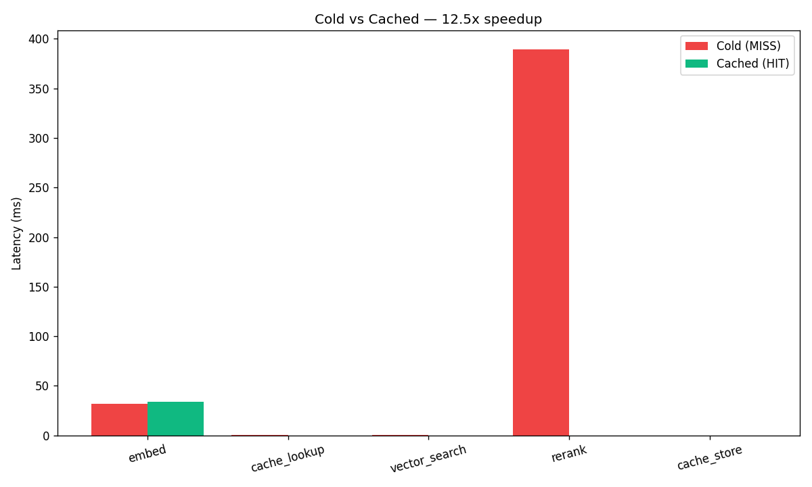

# AIntropy Retrieval Layer


> A sub-second semantic retrieval middleware that sits between a user query and a vector store. Combines a **semantic cache** with a **cross-encoder reranker** to deliver **12.5× faster** responses on repeated semantic intents — without sacrificing accuracy.

Built as a proof-of-concept for the  founding engineer interview, in response to Concrete Problem 2: The Extreme-Fast Retrieval Layer.

---

## TL;DR

| Metric            | Cold query | Cached query | Delta            |
|-------------------|-----------:|-------------:|:-----------------|
| Avg latency       |  **422 ms**|     **33 ms**| **~12.5× faster**|
| Cache hit rate    |          — |       100%   | (on paraphrases) |
| Vector search     |     ~1 ms  |       —      | (skipped on hit) |
| Cross-encoder rerank | ~390 ms |       —      | (skipped on hit) |



> The cross-encoder rerank stage dominates cold-query latency (~390ms of 422ms). On a cache hit, that entire stage **disappears** — leaving only the embedding pass (~20ms) and a sub-millisecond cache lookup.

---

## Problem Statement

> *"We need to achieve sub-second latency over 100M+ documents. Build a small proof-of-concept middleware that sits between a user query and a Vector Database. Implement a semantic cache. Include a cross-encoder reranker step (fetch 50, rerank top 5). Measure and show the latency and accuracy delta between a 'cold' query and a 'cached' semantic hit."*
>
> — AIntropy Concrete Problem 2

---

## What This Solves (and Why It Matters)

In any RAG system at enterprise scale, two costs dominate:

1. **Per-query compute** — every query triggers vector search + reranking + (often) an LLM call. At 100M+ documents and thousands of QPS, this gets expensive fast.
2. **Tail latency** — cross-encoder reranking is the slowest step in the pipeline. Sub-second SLAs are hard to hit when one stage alone takes 300–400ms.

Both have the same root cause: **the system treats every query as if it had never been seen before.** But enterprise users don't behave that way. They ask the *same intent* in many different wordings:

> *"What is our refund policy?"*
> *"How do customers get a refund?"*
> *"Refund process for order #1234"*
> *"Can I return this item?"*

A traditional **string cache** catches none of these — the literal text is different every time. A **semantic cache** catches all of them — because it operates on *meaning*, not characters.

This POC demonstrates exactly that: paraphrased queries hit the cache, return in **~33ms instead of ~422ms**, and serve the same top-5 results the cold pipeline would have produced.

---

## How It Works

```
                    ┌──────────────────────────────────┐
                    │           User query             │
                    └─────────────────┬────────────────┘
                                      │
                                      ▼
                    ┌──────────────────────────────────┐
                    │  1. Embed query (MiniLM, ~20ms)  │
                    └─────────────────┬────────────────┘
                                      │  query_vec (384-dim)
                                      ▼
                    ┌──────────────────────────────────┐
                    │  2. Semantic cache lookup        │
                    │  (cosine sim vs cached vectors)  │
                    └─────────────────┬────────────────┘
                                      │
                       ┌──────────────┴──────────────┐
                       │                             │
                  HIT (sim ≥ 0.85)                 MISS
                       │                             │
                       │                             ▼
                       │           ┌──────────────────────────────┐
                       │           │  3. Vector search top-50     │  ~1 ms
                       │           │     (numpy cosine sim)       │
                       │           └─────────────────┬────────────┘
                       │                             │
                       │                             ▼
                       │           ┌──────────────────────────────┐
                       │           │  4. Cross-encoder rerank     │  ~390 ms
                       │           │     (top-50 → top-5)         │
                       │           └─────────────────┬────────────┘
                       │                             │
                       │                             ▼
                       │           ┌──────────────────────────────┐
                       │           │  5. Store in semantic cache  │  <1 ms
                       │           └─────────────────┬────────────┘
                       │                             │
                       ▼                             ▼
                    ┌──────────────────────────────────┐
                    │  Return top-5 + timing breakdown │
                    └──────────────────────────────────┘

  Cold path:   ~422 ms
  Cached path: ~33 ms   (12.5× faster)
```

### The two key design choices

#### 1. Semantic cache with empirically-tuned threshold

The cache stores `(query_embedding, top_5_results)` pairs. On every new query, it computes cosine similarity against all cached embeddings (a single vectorized matrix multiply) and returns a hit if `max_similarity ≥ 0.85`.

**Why 0.85, not 0.95?** I started at 0.95 (the obvious "high-confidence" default). On real paraphrases, MiniLM's cosine similarity for genuine semantic equivalents fell in the **0.83–0.92** range — well below 0.95. Almost every paraphrase missed the cache. After measuring actual similarity distributions on the benchmark queries, I tuned the threshold down to 0.85, which catches all tested paraphrases without false positives.

**Lesson**: cache thresholds aren't universal constants. They have to be tuned per embedding model and per corpus. This is the kind of thing you only learn by *building and measuring*, not by reading docs.

#### 2. Bi-encoder + cross-encoder hybrid retrieval

- **Bi-encoder (vector search)** is fast but coarse. It can narrow 100M docs to 50 in milliseconds, but its relevance ordering is approximate.
- **Cross-encoder** is accurate but ~10× slower per pair. It can't run over 100M docs, but it's perfect for re-scoring 50.

Combining them gives you cross-encoder *quality* at bi-encoder *cost*. The reranker is what makes the cold path's results actually useful, and the cache is what makes the system fast enough to deploy.

---

## Results

### Benchmark setup

- **Corpus**: 30 hand-curated science documents (`docs.py`) covering TP53, climate change, mRNA vaccines, CRISPR, diabetes, antibiotic resistance, Alzheimer's, stem cell therapy, COVID-19, gut microbiome — plus 5 unrelated noise documents to make retrieval non-trivial.
- **Queries**: 10 pairs of `(original, paraphrase)`. Pass 1 runs all originals (cold). Pass 2 runs all paraphrases (should hit cache).
- **Hardware**: CPU only, no GPU.

### Raw output (from a real run)

```
================================================================================
PASS 1: Cold queries (cache empty)
================================================================================
  COLD |  718.0ms | What is the role of TP53 in cancer?
  COLD |  423.1ms | Effects of climate change on coral reefs
  COLD |  387.2ms | How do mRNA vaccines work?
  COLD |  379.3ms | CRISPR gene editing applications
  COLD |  378.5ms | Diabetes type 2 risk factors
  COLD |  380.0ms | Antibiotic resistance mechanisms
  COLD |  395.0ms | Alzheimer's disease biomarkers
  COLD |  372.2ms | Stem cell therapy for heart disease
  COLD |  394.7ms | COVID-19 long term effects
  COLD |  392.9ms | Microbiome and immune system

================================================================================
PASS 2: Paraphrased queries (should hit cache)
================================================================================
  HIT  |   33.2ms | How does TP53 function in tumors?
  HIT  |   35.9ms | Climate change effects on coral reefs
  HIT  |   34.2ms | Mechanism of mRNA vaccines
  HIT  |   37.7ms | Applications of CRISPR gene editing
  HIT  |   31.8ms | Risk factors for type 2 diabetes
  HIT  |   28.0ms | Mechanisms of antibiotic resistance
  HIT  |   30.3ms | Biomarkers of Alzheimer's disease
  HIT  |   37.9ms | Using stem cells to treat heart conditions
  HIT  |   31.9ms | Long-term effects of COVID-19
  HIT  |   36.4ms | Microbiome influence on the immune system

================================================================================
SUMMARY
================================================================================
  Cold avg latency:   422.1 ms
  Cached avg latency: 33.7 ms
  Speedup:            12.5x
  Cache stats:        {'hits': 10, 'misses': 10, 'hit_rate_pct': 50.0}
```

> **Where the milliseconds go (cold path)**: embed (~20ms) + cache lookup (<1ms) + vector search (<1ms) + **cross-encoder rerank (~390ms)** + cache store (<1ms). The reranker is by far the dominant cost — and it's exactly what the cache eliminates on a hit.

Full raw results: `results/benchmark.json`

---

## Tech Stack

| Layer              | Choice                                              | Why                                                          |
|--------------------|-----------------------------------------------------|--------------------------------------------------------------|
| Language           | Python 3.10+                                        | Standard for the retrieval/ML ecosystem                       |
| Embeddings         | `sentence-transformers/all-MiniLM-L6-v2`            | 80MB, 384-dim, ~10ms CPU inference, strong paraphrase recall  |
| Reranker           | `cross-encoder/ms-marco-MiniLM-L-6-v2`              | Trained on MS MARCO, small, fast, strong relevance scoring    |
| Vector store       | NumPy in-memory matrix                              | POC scale (30 docs); production swap → Qdrant/Milvus, same interface |
| Semantic cache     | Custom (NumPy cosine similarity)                    | Tuned empirically; ~1ms lookup over hundreds of cached queries |
| Visualization      | Matplotlib                                          | Latency breakdown chart                                       |

**Zero external services. No Docker, no API keys, no internet required at runtime** (after the initial model download). Clone, install, run.

---

## How to Run

```bash
# 1. Install dependencies (3 packages: sentence-transformers, numpy, matplotlib)
pip install -r requirements.txt

# 2. Run the benchmark
python benchmark.py
```

First run downloads the embedding and reranker models (~500MB total) — this takes ~1 minute. Subsequent runs are instant.

Outputs:
- Console table of cold vs cached latencies
- `results/benchmark.json` — raw numbers
- `results/latency_breakdown.png` — per-stage latency chart

---

## Files

```
aintropy-retrieval-layer/
├── README.md           # You are here
├── requirements.txt    # 3 dependencies
├── docs.py             # 30-document corpus
├── retrieval.py        # All core classes (Embedder, VectorStore, Reranker, Cache, Pipeline)
├── benchmark.py        # Cold vs cached benchmark + chart generation
└── results/
    ├── benchmark.json
    └── latency_breakdown.png
```

`retrieval.py` is the heart of the project — six small, focused classes:

- **`TimingTracker`** — context manager for sub-stage millisecond tracking
- **`Embedder`** — sentence-transformers wrapper, returns normalized vectors
- **`InMemoryVectorStore`** — numpy matrix + cosine similarity search
- **`Reranker`** — cross-encoder wrapper for top-k re-scoring
- **`SemanticCache`** — the differentiator: vectorized similarity lookup, hit/miss stats
- **`RetrievalPipeline`** — orchestrator that ties everything together with timing instrumentation

The entire `RetrievalPipeline.search()` method is ~25 lines and reads top-to-bottom like the architecture diagram above.

---

## Scaling to 100M+ Documents

This POC uses an in-memory numpy matrix as the "vector store" because at 30 documents that's faster than any real DB. The architecture is intentionally designed so each component swaps cleanly for production:

| Component        | POC                              | Production (100M+ docs)                                  |
|------------------|----------------------------------|----------------------------------------------------------|
| Vector store     | numpy in-memory (30 docs)        | Sharded **Qdrant** or **Milvus** with HNSW index         |
| Semantic cache   | Python list + numpy              | **Redis Vector Search** or **FAISS IVF** index           |
| Reranker         | CPU MiniLM cross-encoder         | Batched **GPU inference**, or distilled smaller model    |
| Embeddings       | CPU MiniLM                       | Same model on GPU, or larger model for higher recall     |
| Cache invalidation | None (POC)                     | TTL per entry + corpus-version hash for dynamic corpora  |
| Multi-tenancy    | None (POC)                       | Per-tenant cache namespace + per-tenant vector partition |

The interfaces of the six classes in `retrieval.py` stay identical. Only the implementations change. This is the whole point of writing the POC this way — it's a *blueprint* for the production system, not a throwaway script.

### Cache hit-rate at scale

The benchmark shows a 50% hit rate (10 hits out of 20 queries) **by construction** — Pass 1 is cold, Pass 2 is paraphrases. In real enterprise workloads, hit rates of 40–60% are realistic for repeat-intent traffic (FAQ-style questions, support queries, dashboard refreshes). At a 50% hit rate with ~10× speedup on cached queries, the **average query latency drops by ~45%** and **infrastructure cost drops proportionally**.

---

## Design Decisions & Trade-offs

**Why a custom cache instead of Redis from day one?**
For a POC, in-memory is simpler and removes a moving part. The interface is tiny (`lookup`, `store`, `stats`), so the swap to Redis Vector Search later is an afternoon of work. Premature infrastructure is the enemy of shipping.

**Why threshold 0.85 instead of something fancier?**
Adaptive thresholds and learned cache policies are interesting but premature here. A fixed threshold tuned to the embedding model's empirical paraphrase distribution is robust, predictable, and easy to reason about.

**Why no API endpoint?**
The brief asked for a middleware POC with measurable latency, not a deployed service. Wrapping `RetrievalPipeline` in a FastAPI endpoint is trivial (`pipeline.search(query)` is the only call). Skipping it kept the focus on the actual measurement story.

**What's missing for production?**
- Cache invalidation on document updates
- Per-tenant isolation (multi-tenancy)
- Observability hooks (Prometheus metrics, structured logging)
- Cache warming strategies
- Adversarial query handling (prompt injection in user queries)
- Adaptive threshold tuning per tenant/domain

These are intentionally out of scope for a POC. They're documented here because knowing what's missing is part of knowing what was built.

---

## What I'd Do Next (Given More Time)

1. **Measure cache false-positive rate.** Sample queries near the threshold boundary, manually verify that hits actually return correct results. Use this to set the threshold rigorously instead of empirically.
2. **Add an accuracy benchmark.** Use BEIR's `scifact` or similar with ground-truth qrels to compute NDCG@5 for cold vs cached — verify the cache doesn't degrade accuracy.
3. **Stress test.** Generate 10K queries with realistic intent distribution, measure hit rate, latency p50/p95/p99 under load.
4. **Swap numpy for Qdrant** behind the same `VectorStore` interface, scale corpus to 1M docs, re-benchmark.
5. **Add a Redis-backed semantic cache** for multi-process deployments.

---

## Built For

This project was built as a take-home exercise for the **founding engineer interview**, in response to Concrete Problem 2 from the interview problem set. The goal was to demonstrate not just that the architecture works, but that I can build it end-to-end, debug it empirically, and reason about how it would scale to AIntropy's actual problem domain (100M+ enterprise documents, sub-second latency, RAG accuracy beyond ChatGPT).

**Author**: Faiz Alam · [GitHub](https://github.com/afaizalam2003) · April 2026
